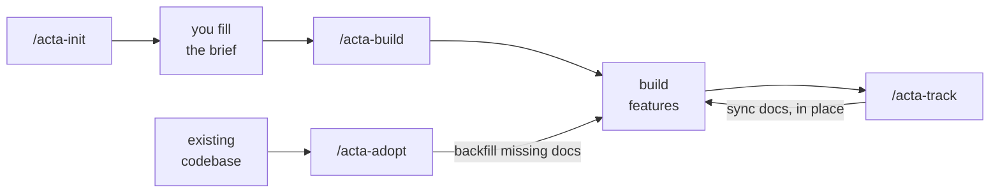

<div align="center">

# Acta

### The engineering memory for Claude Code.

Acta turns [Claude Code](https://claude.com/claude-code) into a one-person engineering team that
**remembers every decision** — and reads that memory before it writes the next line.

_Build software that remembers itself._

[](LICENSE)
[](https://claude.com/claude-code)
[](#contributing)

</div>

---

## The problem

You ship fast with AI — then the context evaporates. Next session Claude has forgotten why you chose Postgres,
`PRD_final2.md` contradicts the code, and every rule you wrote is a prompt you babysit forever.

## The idea

Acta gives your project a **living memory** and wires it into a `CLAUDE.md` **brain** that Claude auto-loads
every session:

```
code change → /acta-track → docs updated → brain updated → next session Claude knows
```

- 📝 **Generated, not hand-written** — Acta writes the docs from your project.
- 🔄 **Always in sync** — `acta-track` keeps them current, so they never rot.
- 🧠 **Always loaded** — the brain is read before every decision, not a file you _hope_ gets used.
- 🎯 **Acts senior** — Claude behaves like a tech lead, not a code vending machine.
- 💡 **Suggests the next step** — at each checkpoint it recommends the right move (sync docs, security review, legal re-review) — in the right place, never nagging.
- 🌍 **Your language** — write the docs in English, Turkish, Japanese… you pick; Claude keeps them there.

> **Not a rules file.** A hand-written rules file is a static prompt applied unevenly. Acta is a memory system
> that grows with the code.

---

## How it works



| Skill             | When                   | What it does                                                     |
| ----------------- | ---------------------- | ---------------------------------------------------------------- |
| **`/acta-init`**  | project start          | Creates a short intake you fill with a simple sign language.     |
| **`/acta-build`** | after the brief        | Detects the project type → fitting docs + the `CLAUDE.md` brain. |
| **`/acta-track`** | after finishing work   | Brings **all** relevant docs to the current state — no bloat.    |
| **`/acta-adopt`** | existing code, no docs | Backfills only the **missing** docs. **Never overwrites.**       |
| **`/acta-audit`** | anytime                | Read-only check that the docs still match the code.              |

---

## The brain

`acta-build` writes this to the top of `CLAUDE.md` — **what Claude reads before it writes:**

```markdown
<!-- acta:index:start -->

## How I work in this project

I work as a senior engineer wearing every hat this one-person project needs (PM, architect,
full-stack, DevOps, security, QA, tech lead). For any non-trivial task: analyze → simplest
solution that fits → check security & performance → define tests → update the docs → self-review.

- Right-size. Never add DDD/CQRS/microservices without a real need.
- Decide, then justify — record why / alternatives / long-term impact as an ADR.
- Unknown stays `TBD` — never fabricate. Read the relevant doc before writing.
- Recommend the next step — after a chunk / before a commit, suggest the fitting move.
- Write docs in this project's language; talk to me in mine.

## Project documentation index

- Product → PRD, Roadmap
- Code & architecture → Structure, Coding standards, ADRs
- Ops & security → Deployment, Env vars
<!-- acta:index:end -->
```

That block is why the memory is **active**, not a passive index: every session Claude works from your
decisions instead of guessing.

---

## What you get

Point `/acta-build` at a project and Acta lays down a **fitting doc tree** — never every possible file:

```text
CLAUDE.md            # the brain, auto-loaded every session
.claude/acta.md      # registry: project profile + which docs exist
docs/
├─ README.md         # index of everything
├─ progress.md
├─ product/          prd.md · roadmap-vision.md · requirements-functional.md
├─ architecture/     overview.md · adr/0001-initial-architecture.md
├─ engineering/      project-structure.md · coding-standards.md · git-workflow.md
├─ operations/       deployment.md · env-vars.md
└─ ai/               ai-context.md
```

**Type-aware:** an LLM app also gets `docs/llm/…`, a game `docs/game/…`, a fintech app `docs/fintech/…`.

It picks from **six core disciplines** (product · project · code · quality · ops · ai) plus a matching
**domain pack** — `ml`, `llm`, `security`, `data`, `game`, `hardware`, `web3`, `devops`, `robotics`, `xr`,
`fintech`, `scientific`, `media`, `geospatial`. You choose which disciplines, and how deep. See
[`acta/doc-catalog.md`](acta/doc-catalog.md) for the full contract.

---

## Beyond the docs

Three optional layers ship your product off the **same** source of truth:

🎨 **Design** — `/acta-design` · `/acta-design-prompt` · `/acta-design-track`
Brand, design-system, and real generated design (landing, logo, deck, ads) — plus scope-locked
[Claude Design](https://claude.ai/design) prompts. Wired into the brain so Claude follows your tokens.

💰 **Business** — `/acta-business`
An **iterative** modeling partner (not a one-shot): pricing, unit economics (LTV / CAC / margin), and
best/base/worst projections with your real numbers. It sanity-checks every change before you commit to it.

⚖️ **Legal** — `/acta-legal` · `/acta-legal-track` · `/acta-legal-brief`
**Region-aware** briefs (KVKK, GDPR, CCPA, PIPL, APPI…): it warns _you_ about the risks and briefs a
_lawyer_ with the facts — but **never writes binding legal text**, and always says _get a lawyer_.
`/acta-legal-brief` consolidates everything into one document to take to that lawyer.

> 🔒 Pricing and legal are sensitive, so `acta-build` git-ignores `docs/business/` + `docs/legal/` by default.
> Claude still reads them locally — they just never leak to a public repo.

---

## The brief sign language

Filling the brief, any field can be a single symbol instead of an answer:

| You write  | Means                                             |
| ---------- | ------------------------------------------------- |
| plain text | I know this — use it as-is                        |
| **`?`**    | _Suggest one for me_ — Acta proposes, you confirm |
| **`-`**    | _Skip_ — unknown or N/A; don't ask                |
| _(blank)_  | A real gap — Acta will ask                        |

---

## Install

```bash
git clone https://github.com/erenisci/acta.git
cd acta
./install.ps1     # Windows (PowerShell)
./install.sh      # macOS / Linux
```

Then restart Claude Code so the `/acta-*` commands register.

## Quick start

```
# New project
/acta-init           # creates PROJECT_BRIEF.md — fill it (? = suggest, - = skip)
/acta-build          # detects type → docs/ + CLAUDE.md brain
# … build features …
/acta-track          # keeps every doc current, in one command

# Existing codebase, no docs
/acta-adopt          # generates only the missing docs, never overwrites
```

---

## Philosophy

- Documentation is code.
- AI reads before it writes.
- Docs evolve with the project — or they're lies.
- Unknown stays `TBD`, never fabricated.
- Every engineering decision is traceable.
- Right-size for a solo builder, not a 50-person company.

> The value isn't the code — every model writes code. It's the **judgment**: the right architecture, less
> complexity, foreseen risk, and a traceable _why_ behind every change. Optimize for decisions, not keystrokes.

## Contributing

Issues and PRs welcome — new templates, discipline/pack coverage, and stack detectors especially.
Every doc Acta writes follows the contract in [`acta/doc-catalog.md`](acta/doc-catalog.md).

## License

[MIT](LICENSE) © erenisci
