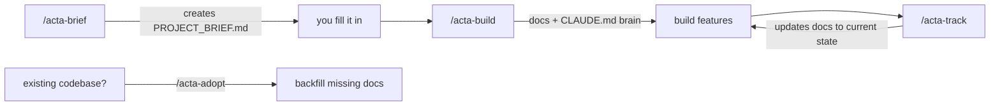

<div align="center">

# Acta

### Engineering documentation, done for you — as Claude Code skills.

**Acta** is a family of [Claude Code](https://claude.com/claude-code) skills that lets a **solo developer**
document a software project from **zero to done** — PRD, architecture, ADRs, testing, ops, changelog — and
wires every document into a **`CLAUDE.md` "brain"** so the AI reads the right doc in every future session.

Documentation-driven development for one person. Living docs that stay in sync. A codebase that explains itself.

[](LICENSE)
[](https://claude.com/claude-code)
[](#contributing)

</div>

---

## Why Acta?

Most AI coding is _vibe-coding_: no spec, no record, no memory. The next session starts from zero.

Acta makes **documentation the source of truth** and keeps it alive:

- 🧠 **A brain, not a folder.** Every doc is linked from a `CLAUDE.md` Context Index, so Claude (and future‑you) always knows which doc to read before touching an area.
- ♻️ **Living docs, no bloat.** `acta-track` updates docs in place after each chunk of work — it consolidates current‑state docs and appends only true logs. Docs stay the size of the truth.
- 👤 **Built for solo builders.** Team-only ceremony (heavy RFC/incident process, external contribution flow) is kept light or optional. Full SDLC coverage, right-sized for one.
- 🧩 **Right-sized, adaptive.** Pick disciplines and depth (`core` / `standard` / `full`). Acta generates only what your project needs — not 70 dead files.
- 🚫 **Never fabricates.** Unknown → `TBD`. Never overwrites your docs without consent.

## The pipeline



| Skill             | When                   | What it does                                                                                       |
| ----------------- | ---------------------- | -------------------------------------------------------------------------------------------------- |
| **`/acta-brief`** | project start          | Creates `<PROJECT>_BRIEF.md` — a short intake you fill with a simple sign language.                |
| **`/acta-build`** | after the brief        | Reads the brief, suggests values, asks only real gaps, generates the docs + the `CLAUDE.md` brain. |
| **`/acta-track`** | after finishing work   | Brings **all** relevant docs to the current state in one shot — without bloating them.             |
| **`/acta-adopt`** | existing code, no docs | Reverse-engineers the **missing** docs from your code. **Never overwrites** existing docs.         |

## The brief sign language

When you fill `<PROJECT>_BRIEF.md`, any field can be a single symbol instead of an answer:

| You write  | Means                                                     |
| ---------- | --------------------------------------------------------- |
| plain text | I know this — use it as-is                                |
| **`?`**    | _Suggest one for me_ — Acta proposes a value, you confirm |
| **`-`**    | _Skip_ — unknown or not applicable; don't ask             |
| _(blank)_  | A real gap — Acta will ask you about it                   |

## Install

Acta ships as four skills plus a shared resource folder. Clone and run the installer:

```bash
git clone https://github.com/erenisci/acta.git
cd acta
# Windows (PowerShell)
./install.ps1
# macOS / Linux
./install.sh
```

Or copy manually into your Claude config:

```
skills/acta-*   →  ~/.claude/skills/
acta/           →  ~/.claude/acta/
```

Restart Claude Code so the `/acta-*` commands register.

## Quick start

**New project (greenfield):**

```
/acta-brief          # creates PROJECT_BRIEF.md
# → fill in what you know; use ? for "suggest" and - for "skip"
/acta-build          # generates docs/ + CLAUDE.md brain
# … build features …
/acta-track          # keeps every doc current, in one command
```

**Existing codebase with no docs:**

```
/acta-adopt          # scans the code, generates only the missing docs, never overwrites
```

## What Acta generates

A right-sized set across six disciplines (you choose which, and how deep):

- **product** — PRD, requirements (functional / NFR), user stories, feature specs, roadmap, glossary
- **project** — roadmap, progress, changelog, DoR/DoD, risk register, tech-debt log
- **code** — project structure, coding standards, git workflow, architecture overview, ADRs, API, DB/ERD
- **quality** — testing strategy, unit/integration/e2e guidelines, QA checklist
- **ops** — CI/CD, deployment, config & env, logging, monitoring, error handling, backup/DR, security, threat model
- **ai** — AI development guidelines, AI context doc, prompt library, AI decision log

Plus the always-on layer: `README`, `CLAUDE.md` (the brain), `docs/README.md` index, `glossary`, `CHANGELOG`.

Filenames follow the common standard: root meta-files (`README.md`, `CHANGELOG.md`, `CLAUDE.md`) UPPERCASE; everything under `docs/` lowercase kebab-case. See [`acta/doc-catalog.md`](acta/doc-catalog.md) for the full contract.

## Roadmap

Acta is a growing **family** of `acta-*` skills:

- ✅ `acta-brief` · `acta-build` · `acta-track` · `acta-adopt` — the documentation pipeline
- 🔜 **`acta-design`** — reads your Acta docs (brand, product) and generates ready-to-paste **Claude Design** prompts, so your visuals inherit the same source of truth as your code.
- 💡 More disciplines and per-stack detection over time.

## Contributing

Issues and PRs welcome — new templates, discipline coverage, and stack detectors especially.
Every doc Acta writes follows the contract in [`acta/doc-catalog.md`](acta/doc-catalog.md).

## License

[MIT](LICENSE) © erenisci

<div align="center">
<sub>Acta — Latin <em>acta</em>: the official record of what was done. Your project's record, kept for you.</sub>
</div>
