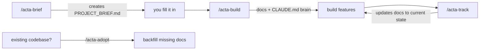

<div align="center">

# Acta

### The engineering memory for Claude Code.

**Acta** turns [Claude Code](https://claude.com/claude-code) into a one-person engineering team with a **persistent
memory.** It captures every product, architecture, and ops decision as **living documentation**, wires it into a
`CLAUDE.md` **brain that Claude reads before it writes**, and keeps it **in sync** as your code changes.

_Build software that remembers itself._

[](LICENSE)
[](https://claude.com/claude-code)
[](#contributing)

</div>

---

## Why not just Cursor rules or a big prompt?

A hand-written rules file is a **static prompt you maintain forever**, and the model applies it unevenly. Acta is a
**living memory system**, not a rules file:

- It **generates** the docs from your project — you don't hand-write them.
- It **keeps them in sync** with the code (`acta-track` / `acta-adopt`), so they never rot.
- Claude **auto-consults** the `CLAUDE.md` brain before every decision — it's always loaded, not a file you _hope_ gets read.
- It makes Claude **behave like a senior tech lead**, not a code vending machine (see below).

## The memory — and why it matters

Every document becomes part of a **single engineering memory that Claude consults before making decisions.** No more
`PRD_v2.md`, `PRD_final.md`, `PRD_final2.md`: Acta keeps **one `PRD.md` that always reflects reality**, updated in
place. The loop:

```
code change → /acta-track → docs updated → CLAUDE.md brain updated → next session Claude uses the new knowledge
```

## How Claude works with Acta

With the brain loaded, Claude stops being a code generator and works as a **senior engineer running a one-person
technology company** — PM, architect, full-stack, UI/UX, DevOps, security, QA, tech lead, as each task needs:

1. **Analyze** → 2. **extract requirements** (ask if missing) → 3. choose the **simplest solution that fits** → 4. check **security & performance** → 5. define **tests** → 6. **update the docs** → 7. **self-review.**

Two rules that make it senior, not junior:

- **Right-size — never force methodologies.** No DDD / CQRS / microservices for a blog. Complexity must be _earned_ by a real requirement.
- **Decide, then justify.** Every significant decision records _why, the alternatives, why not them, the long-term impact, and the at-scale risk_ — as an ADR.

> The value isn't the code — every model writes code. It's the **engineering judgment**: the right architecture, less
> complexity, foreseen risk, managed tech debt, and a traceable _why_ behind every change. Optimize for decisions, not keystrokes.

## Philosophy

- Documentation is code.
- AI reads before it writes.
- Docs evolve with the project — or they're lies.
- Unknown stays unknown (`TBD`, never fabricated).
- Every engineering decision is traceable.
- Right-size for a solo builder, not a 50-person company.

## What it looks like

Point `/acta-build` at a project and Acta lays down a **fitting doc tree** and the **brain**:

```text
CLAUDE.md                       # the brain — auto-loaded by Claude Code every session
CHANGELOG.md
.claude/acta.md                 # registry: project profile + which docs exist
docs/
├─ README.md                    # index of everything
├─ progress.md
├─ product/
│  ├─ prd.md
│  ├─ roadmap-vision.md
│  └─ requirements-functional.md
├─ architecture/
│  ├─ overview.md
│  └─ adr/0001-initial-architecture.md
├─ engineering/
│  ├─ project-structure.md
│  ├─ coding-standards.md
│  └─ git-workflow.md
├─ operations/
│  ├─ deployment.md
│  └─ env-vars.md
└─ ai/ai-context.md
```

> Type-aware: an **LLM app** also gets `docs/llm/…`, a **game** `docs/game/…`, a **fintech** app `docs/fintech/…` — only what fits, never every file.

And the top of the generated `CLAUDE.md` — **this is what Claude reads before it writes:**

```markdown
<!-- acta:index:start -->

## How I work in this project

I work as a senior engineer wearing every hat this one-person project needs (PM, architect, full-stack,
DevOps, security, QA, tech lead). For any non-trivial task: analyze → simplest solution that fits →
check security & performance → define tests → update the docs below → self-review.

- Right-size. Never add DDD/CQRS/microservices without a real need.
- Decide, then justify — record why / alternatives / long-term impact as an ADR.
- Unknown stays `TBD` — never fabricate. Read the relevant doc before writing.

## Project documentation index

- Product — what & why → PRD (docs/product/prd.md), Roadmap (docs/product/roadmap-vision.md)
- Code & architecture → Structure, Coding standards, ADRs (docs/architecture/adr/)
- Ops & security → Deployment, Env vars
<!-- acta:index:end -->
```

## The pipeline



| Skill             | When                   | What it does                                                                                       |
| ----------------- | ---------------------- | -------------------------------------------------------------------------------------------------- |
| **`/acta-brief`** | project start          | Creates `<PROJECT>_BRIEF.md` — a short intake you fill with a simple sign language.                |
| **`/acta-build`** | after the brief        | Detects the project type, sets up a fitting structure, generates the docs + the `CLAUDE.md` brain. |
| **`/acta-track`** | after finishing work   | Brings **all** relevant docs to the current state in one shot — without bloating them.             |
| **`/acta-adopt`** | existing code, no docs | Reverse-engineers the **missing** docs from your code. **Never overwrites** existing docs.         |

> **Plus, outside the linear flow:** `/acta-audit` verifies the docs still match the code (read-only), the **design
> layer** (`/acta-design` · `/acta-design-prompt` · `/acta-design-track`) turns your product docs into a brand +
> design-system and real design, and the **business & legal layer** (`/acta-business` · `/acta-legal` ·
> `/acta-legal-track`) models pricing and prepares region-aware legal briefs — all from the same source of truth.
> The design, business, and legal sections below cover these.

## The brief sign language

When you fill `<PROJECT>_BRIEF.md`, any field can be a single symbol instead of an answer:

| You write  | Means                                                     |
| ---------- | --------------------------------------------------------- |
| plain text | I know this — use it as-is                                |
| **`?`**    | _Suggest one for me_ — Acta proposes a value, you confirm |
| **`-`**    | _Skip_ — unknown or not applicable; don't ask             |
| _(blank)_  | A real gap — Acta will ask you about it                   |

## Install

```bash
git clone https://github.com/erenisci/acta.git
cd acta
# Windows (PowerShell)
./install.ps1
# macOS / Linux
./install.sh
```

Or copy manually into your Claude config: `skills/acta-*` → `~/.claude/skills/` and `acta/` → `~/.claude/acta/`.
Restart Claude Code so the `/acta-*` commands register.

## Quick start

```
# New project
/acta-brief          # creates PROJECT_BRIEF.md — fill it (? = suggest, - = skip)
/acta-build          # detects type → docs/ + CLAUDE.md brain
# … build features …
/acta-track          # keeps every doc current, in one command

# Existing codebase with no docs
/acta-adopt          # generates only the missing docs, never overwrites
```

## What Acta generates

Acta **detects your project type** from the brief (web app, API, LLM app, game, ML, security tool…) and sets up a
**fitting structure** — the universal core plus the matching **domain pack** — not every possible file.

Universal core — six disciplines (you choose which, and how deep):

- **product** — PRD, requirements (functional / NFR), user stories, feature specs, roadmap, glossary
- **project** — roadmap, progress, changelog, DoR/DoD, risk register, tech-debt log
- **code** — project structure, coding standards, git workflow, architecture overview, ADRs, API, DB/ERD
- **quality** — testing strategy, unit/integration/e2e guidelines, QA checklist
- **ops** — CI/CD, deployment, config & env, logging, monitoring, error handling, backup/DR, security, threat model
- **ai** — AI development guidelines, AI context doc, prompt library, AI decision log

**Domain packs** layer on for specialized projects (auto-selected by type): `ml`, `llm`, `security`, `data`, `game`, `hardware`, `web3`, `devops`, `robotics`, `xr`, `fintech`, `scientific`, `media`, `geospatial`.

Plus the always-on layer: `README`, `CLAUDE.md` (the brain), `docs/README.md` index, `glossary`, `CHANGELOG`.

Filenames follow the common standard: root meta-files (`README.md`, `CHANGELOG.md`, `CLAUDE.md`) UPPERCASE; everything under `docs/` lowercase kebab-case. See [`acta/doc-catalog.md`](acta/doc-catalog.md) for the full contract, and [`acta/principles.md`](acta/principles.md) for how Claude is asked to operate.

## The design layer

Beyond docs, Acta runs your **brand, design system, and marketing** off the same source of truth — so the design
tells the same story as the product and the code. Three skills:

- **`/acta-design`** — establishes `docs/design/` (`brand.md`, `design-system.md`, `messaging.md`, `components.md`)
  and **generates real design** — a landing page, logo, deck, or ads — as a live, self-contained Artifact you can open,
  tweak in plain English, and export. The design-system captures **your** conventions: it detects whether you use
  Tailwind / CSS Modules / styled-components / vanilla CSS and never dictates a stack, then wires the tokens into
  `CLAUDE.md` so Claude follows them when it writes UI.
- **`/acta-design-prompt`** — turns those docs into **paste-ready [Claude Design](https://claude.ai/design) prompts plus the real copy**,
  **scope-locked** to the actual spec: if the sign-up form is email + password, the prompt tells Claude Design _not_ to
  invent a phone field. On-brand, for every surface (web, logo, deck, ads, og-image).
- **`/acta-design-track`** — when you change styling in code (a new token, a new variant), it syncs `docs/design/`
  back to reality, in place.

Because the brand, the copy, and the tokens all live in the same memory, `acta-design` never produces a generic
look or lorem-ipsum — and `acta-audit` also checks the code for rogue colors or components that drift from the
design-system.

## Business & legal

Two more layers turn a documented project into a **shippable product** — kept private by default (git-ignored):

- **`/acta-business`** — an **iterative** modeling partner (not a one-shot). Reason through pricing, unit economics
  (LTV / CAC / margin), and **best / base / worst-case** projections with your real numbers; it sanity-checks every
  pricing change and records the decision in `docs/business/`.
- **`/acta-legal`** + **`/acta-legal-track`** — **region-aware** legal groundwork: it detects which regimes apply to
  your users (KVKK, GDPR, CCPA, PIPL, APPI…), **warns you** about the risks, and **briefs a lawyer** with the product
  facts — but **never writes binding legal text**, and always says _get a lawyer_. `acta-legal-track` flags when a
  product change (adding cookies, a new market, a new vendor) needs a fresh legal review.

Because pricing, margins, and legal briefs are sensitive, `acta-build` git-ignores `docs/business/` and `docs/legal/`
by default (toggleable per area) — Claude still reads them locally; they just never leak to a public repo.

## Contributing

Issues and PRs welcome — new templates, discipline/pack coverage, and stack detectors especially.
Every doc Acta writes follows the contract in [`acta/doc-catalog.md`](acta/doc-catalog.md).

## License

[MIT](LICENSE) © erenisci
